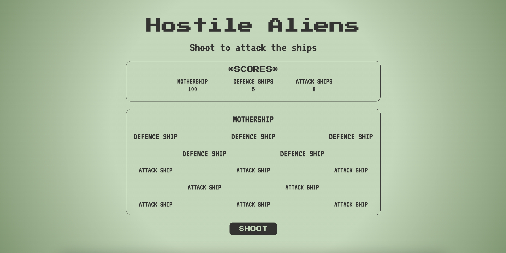

# Hostile Aliens Game

A simple web-based, text-only game loosly based on Space Invaders, featuring a single button which hits a random alien ship in the fleet. Each time the button is pressed, a random alien ship is targeted and its hit points are reduced. Once an alien ship reaches zero hit points, it is destroyed and can't be hit again. The game is over once all of the alien ships have been destroyed.

  

## Technologies & Features:

- Vanilla JavaScript
- OOP approach
- Unit Tested using Jest
- HTML5
- CSS/SCSS
- Mobile first / responsive design
- Git Version Control

## Further Developments:

- Include a start screen which introduces the player to the game.
- Add a timer to make completing the game time-dependent.
