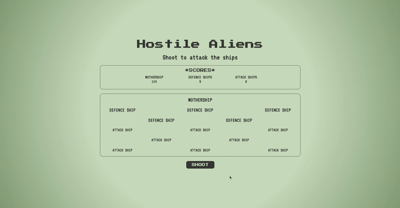

# Hostile Aliens Game

> _A simple web-based, text-only game loosly based on Space Invaders, featuring a single button which hits a random alien ship in the fleet. Each time the button is pressed, a random alien ship is targeted and its hit points are reduced. Once an alien ship reaches zero hit points, it is destroyed and can't be hit again. The game is over once all of the alien ships have been destroyed._</br>

<p align="center">
  
</p>

## Approach

1. This project used OOP principles, so my first task was to create a Ship class that included the following methods: getShipHP(), applyShipDamage(), targetShip(), untargetShip() and generateShipHTML():

```javascript
class Ship {
  constructor(type, hp, damage, html) {
    this.type = type;
    this.hp = hp;
    this.damage = damage;
    this.html = html;
  }

  getShipHP() {
    return this.hp;
  }

  applyShipDamage() {
    this.hp = this.hp - this.damage;
  }

  targetShip() {
    this.targeted = true;
  }

  untargetShip() {
    this.targeted = false;
  }

  generateShipHTML(titleType, i) {
    if (this.hp < 1) {
      return `
    <div class="ships__container--${i + 1} sunk">
      <${titleType} class="ship__${
        this.html
      }">${this.type.toUpperCase()}</${titleType}>
    </div>
    `;
    } else if (this.targeted) {
      return `
      <div class="ships__container--${i + 1} animated">
        <${titleType} class="ship__${
        this.html
      }">${this.type.toUpperCase()}</${titleType}>
      </div>
      `;
    }
    return `
    <div class="ships__container--${i + 1}">
      <${titleType} class="ship__${
      this.html
    }">${this.type.toUpperCase()}</${titleType}>
    </div>
    `;
  }
}
```

2. The next step was to use a pure function to generate a fleet of ship objects of three different types: i settled on a formation of 1 mothership, 5 defence ships and 8 attack ships. The function took four parameters: shipClass (the argument I passed was the class above), mothershipAmount, defenceShipAmount and attackShipAmount. This enabled me to make my fleet dynamic, allowing for changes to the fleet further down the line if necessary.

3. The resulting array (the fleet) was then pushed to an activeFleetArr variable to identify it as 'active'.

4. The next step was to generate the HTML for the fleet. I wanted to keep my index.HTML file clean and minimal, so that I could add/remove elements from the DOM dynamically depending on user input. The pure function responsible for this step loops through the fleet array and uses each ship object's generateShipHTML() method to add a unique HTML element that reflects the type and status of the ship (i.e., if the ship is sunk or targeted). This made dynamically styling the different types of ships depending on their status much easier.

5. Pure functions were also written to dynamically generate and update the player scores and associated HTML elements.

6. The generation of both the fleet and scores HTML were combined into a generateHTML() pure function, to facilitate loading a new game upon a 'Game Over' scenario (see below). A seeries of query selectors passed into the functions as arguments identified the relevant containers in the DOM for the generated HTML elements.

7. A hitRandomShip(fleetArr) function was added, making use of ships objects' targetShip() and applyShipDamage() methods to simulate a single random ship taking damage.

8. A function was required to sink any ships whose hp were below 0. This function takes the fleet array as a parameter and returns a filtered array.

9. When the 'Shoot' button is clicked by the user, an event listerner is triggered, executing a series of pure functions that result in the following:

- A random ship takes damage;
- The fleet array is filtered to remove any destroyed ships;
- The scores and associated HTML are updated;
- The filtered fleet array is pushed to a variable to identify it as 'active'.
- All ship in the fleet are 'untargeted' (this enables the scss 'hit' animation to end)
- A 'game over' function is executed which, if all the ship have been destroyed, loads the 'Game Over' screen.

10. Finally, I added an event listener to the 'Restart' button on the game over screen, which newly generates the fleet, scores and associated HTML, so the game starts over.

## Testing

Using a TDD approach, the application's Ship class, the class methods and the pure functions were tested using JEST in a seperate test.js file.

## Technologies & Features:

- Vanilla JavaScript
- OOP approach
- Unit-tested using Jest
- HTML5
- CSS/SCSS
- Mobile first / responsive design
- Git Version Control

## Further Developments:

- Include a start screen which introduces the player to the game.
- Add a timer to make completing the game time-dependent.
